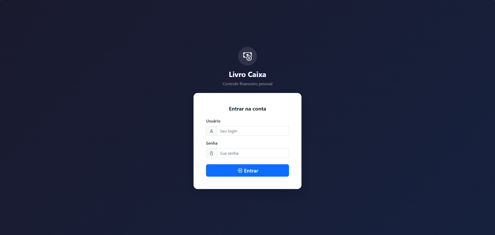
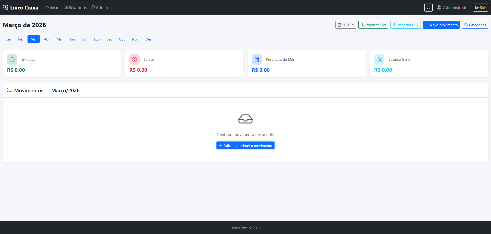
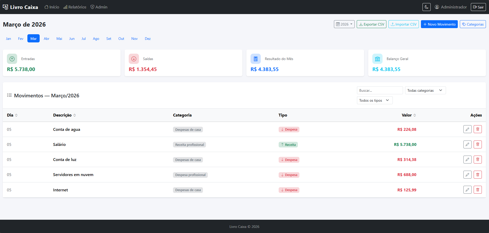
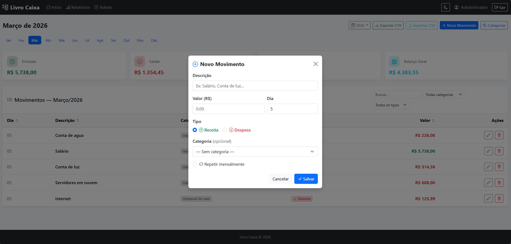
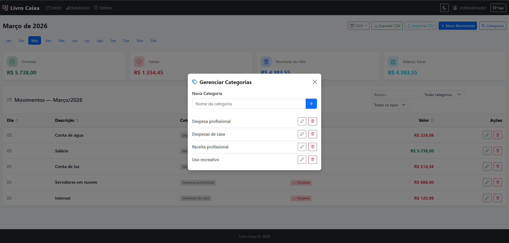
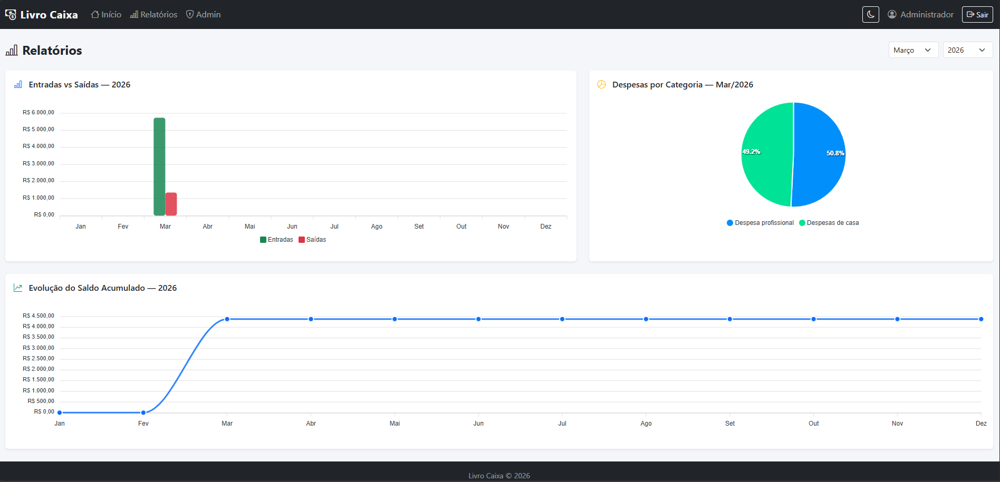
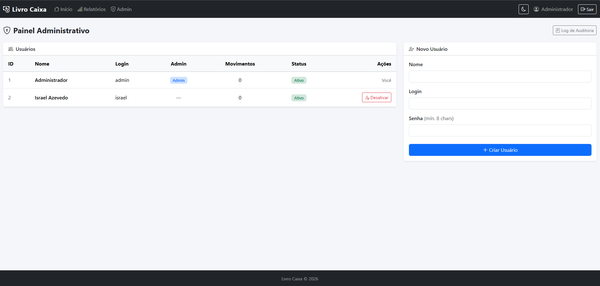
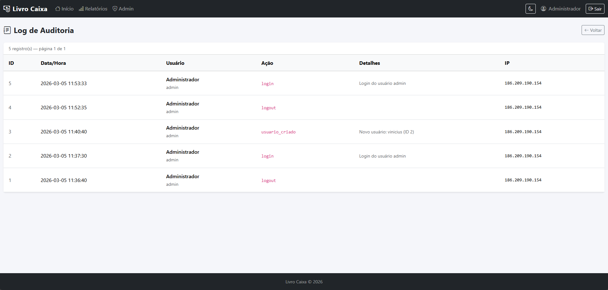
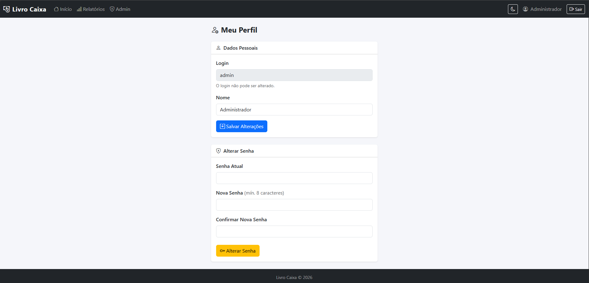

# Livro Caixa

Sistema web de controle financeiro pessoal desenvolvido em PHP com arquitetura MVC, suporte a múltiplos usuários e diversas funcionalidades para gerenciamento de receitas e despesas.

---

## Funcionalidades

### Controle Financeiro
- Lançamento de receitas e despesas por mês/ano
- Categorização de movimentos
- Navegação rápida entre meses
- Cards de resumo: entradas, saídas, resultado do mês e balanço geral

### Novidades (v3)
- **Movimentos recorrentes** — marque um movimento para repetir mensalmente; ele é gerado automaticamente ao abrir um mês sem lançamentos
- **Relatórios com gráficos** — entradas vs saídas por mês (barra), despesas por categoria (pizza) e evolução do saldo acumulado (linha) via ApexCharts
- **Filtros em tempo real** — busca por texto, categoria e tipo sem recarregar a página
- **Exportar CSV** — exporta os movimentos do mês com BOM UTF-8 (compatível com Excel)
- **Importar CSV** — importa movimentos em lote com preview antes de confirmar
- **Perfil do usuário** — alterar nome e senha
- **Painel Admin** — criar usuários, ativar/desativar contas (somente admin)
- **Rate limiting** — bloqueio automático por IP após 5 tentativas de login falhas
- **Log de auditoria** — registro de todas as ações relevantes do sistema
- **Modal de confirmação** — substituição do `confirm()` nativo por modal Bootstrap
- **Dark mode** — alternância entre tema claro e escuro com persistência via localStorage
- **Ordenação de tabela** — clique nos cabeçalhos da tabela para ordenar

---

## Screenshots

### Tela de Login


### Dashboard — Visão Geral


### Dashboard — Movimentos com Filtros e Ordenação


### Lançar Novo Movimento (com opção de recorrência)


### Gerenciar Categorias


### Relatórios com Gráficos


### Painel Administrativo


### Log de Auditoria


### Perfil do Usuário


---

## Tecnologias

| Camada | Tecnologia |
|--------|------------|
| Back-end | PHP 8.1+ (MVC sem framework) |
| Banco de dados | MySQL 5.7+ / MariaDB |
| Front-end | Bootstrap 5.3, Bootstrap Icons |
| Gráficos | ApexCharts 3.x (CDN) |
| Acesso ao banco | PDO com prepared statements |

---

## Requisitos

- PHP 8.1 ou superior
- MySQL 5.7+ ou MariaDB 10.4+
- Servidor web com suporte a `.htaccess` (Apache com `mod_rewrite`) ou Nginx configurado
- Extensões PHP: `pdo`, `pdo_mysql`, `mbstring`

---

## Instalação

### 1. Clone o repositório

```bash
git clone https://github.com/seu-usuario/livro-caixa.git
cd livro-caixa
```

### 2. Configure o banco de dados

Crie o banco e importe os schemas na ordem:

```bash
mysql -u seu_usuario -p < schema/livro_caixa_v2.sql
mysql -u seu_usuario -p < schema/migration_v3.sql
```

Ou importe via phpMyAdmin / Workbench.

### 3. Configure a aplicação

Edite o arquivo `config/config.php`:

```php
define('DB_HOST', 'localhost');
define('DB_NAME', 'livro_caixa');
define('DB_USER', 'seu_usuario');
define('DB_PASS', 'sua_senha');

define('APP_NAME', 'Livro Caixa');
define('BASE_URL', 'https://seu-dominio.com');  // sem barra no final
```

### 4. Configure o servidor web

**Apache** — certifique-se de que `mod_rewrite` está ativo e o `DocumentRoot` ou `VirtualHost` aponta para a pasta `public/`:

```apacheconf
<VirtualHost *:80>
    DocumentRoot "/caminho/para/livro-caixa/public"
    ServerName seu-dominio.com
    <Directory "/caminho/para/livro-caixa/public">
        AllowOverride All
        Require all granted
    </Directory>
</VirtualHost>
```

**Nginx** — redirecione tudo para `public/index.php`:

```nginx
root /caminho/para/livro-caixa/public;
index index.php;

location / {
    try_files $uri $uri/ /index.php?$query_string;
}

location ~ \.php$ {
    fastcgi_pass unix:/run/php/php8.1-fpm.sock;
    fastcgi_param SCRIPT_FILENAME $document_root$fastcgi_script_name;
    include fastcgi_params;
}
```

### 5. Acesse o sistema

Abra o navegador na URL configurada em `BASE_URL`.

**Credenciais iniciais:**
- Login: `admin`
- Senha: `admin123`

> **Altere a senha do admin imediatamente após o primeiro acesso** em Perfil → Alterar Senha.

---

## Estrutura de Diretórios

```
livro-caixa/
├── app/
│   ├── Controllers/
│   │   ├── AuthController.php
│   │   ├── MovimentoController.php
│   │   ├── CategoriaController.php
│   │   ├── RelatorioController.php
│   │   ├── UserController.php
│   │   └── AdminController.php
│   ├── Core/
│   │   ├── Controller.php
│   │   ├── Router.php
│   │   └── View.php
│   ├── Models/
│   │   ├── Database.php
│   │   ├── UserModel.php
│   │   ├── MovimentoModel.php
│   │   ├── CategoriaModel.php
│   │   └── AuditModel.php
│   └── Views/
│       ├── layouts/          # header.php e footer.php
│       ├── auth/             # login.php
│       ├── movimentos/       # index.php, importar.php
│       ├── relatorios/       # index.php
│       ├── user/             # perfil.php
│       ├── admin/            # index.php, audit_log.php
│       └── errors/           # 404.php, 500.php
├── config/
│   └── config.php
├── public/
│   ├── index.php             # front controller
│   ├── .htaccess
│   └── assets/
│       ├── css/app.css
│       └── js/app.js
├── schema/
│   ├── livro_caixa_v2.sql    # schema inicial
│   └── migration_v3.sql      # migração para v3
└── .htaccess                 # redireciona para public/
```

---

## Importação de CSV

O arquivo deve ter as seguintes colunas (com ou sem cabeçalho):

```
dia,descricao,valor,tipo,categoria
```

**Exemplos de valores aceitos para `tipo`:** `receita`, `entrada`, `r`, `despesa`, `saida`, `saída`, `d`

**Exemplo de arquivo:**

```csv
dia,descricao,valor,tipo,categoria
05,Salário,3500.00,receita,
10,Conta de luz,180.50,despesa,Moradia
15,Mercado,420.00,despesa,Alimentação
```

---

## Segurança

- Proteção CSRF em todos os formulários POST
- Senhas com hash bcrypt (`password_hash` / `password_verify`)
- Saídas com `htmlspecialchars` em todas as views
- `session_regenerate_id` após autenticação
- Rate limiting por IP (bloqueio de 10 minutos após 5 falhas)
- Isolamento total de dados por usuário (todas as queries filtram por `user_id`)

---

## Agradecimentos

Este projeto é baseado no trabalho original de **Paulo Collares**:

> **Livro Caixa PHP**
> [https://github.com/pcollares/Livro-caixa-PHP](https://github.com/pcollares/Livro-caixa-PHP)
> Autor: Paulo Collares

O projeto original serviu de inspiração e ponto de partida. Esta versão evoluiu com refatoração completa para arquitetura MVC, suporte a múltiplos usuários e as funcionalidades descritas acima.

Muito obrigado ao Paulo Collares por disponibilizar o trabalho original de forma aberta!

---

## Licença

Distribuído sob a mesma licença do projeto original. Consulte o repositório do autor original para detalhes.
